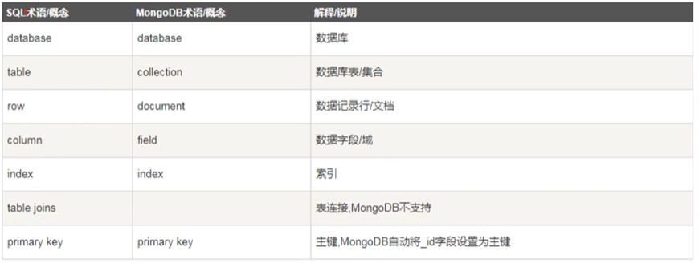

## 开始

MongoDB是一个基于文件存储的数据库，是NoSQL数据库，是一个介于关系型和非关系型数据库之间的产品。 他支持的数据结构非常松散，是类似json的bosn格式

特点：支持的的查询语言非常强大，其语法特点有点类似于面向对象查询语言，几乎可以实现类似关系数据库单表查询的绝大部分功能， 而且还支持对数据建立索引

```
安装 MongoDB 数据
https://www.mongodb.com/try/download/community
MongoDB 文档
https://www.mongodb.com/docs/manual/
教学视频
https://www.bilibili.com/video/BV1am4y1Q7rC?p=1

安装 Navicat Premium 15 图形化软件
安装node
npm install mongoose --save
```

术语概率


## 数据库相关命令

```
使用数据库，如果没有数据库自动创建一个数据库
数据库里面必须有集合，并且集合必须有数据才能看见
use 数据库名

查看数据库
show database
show dbs

删除数据库
db.dropDatabase()
```

## 集合操作

```
创建user集合，相当于MySql创建表
db.createCollection("user")
name:集合名，opions:可选参数，指定有关内存大小及索引的选项
db.createCollection(name,opions)
opions:{
    capped:布尔类型,可选,如果为true,则创建固定集合,集合大小固定,当达到最大值时,他会自动覆盖最早的文档;为true时必须指定size
    autoindexid:布尔类型,如果为true,自动在id字段上创建索引,默认false
    size:数值,可以指定集合最大值,以字节
    max:数值,固定集合中文档的最大数量(可以存多少条数据),使用时必须设置size和capped
}

删除集合
db.user.drop()

查看集合
show tables;
show collections;

插入文档，相当于MySql插入数据
db.user.insert({name:"小明",age:18})

数据集合查询
db.user.find()

//设置索引是为了优化查询速度---但是索引不要建太多
创建索引--  1:username值按升序存储，-1:age值按降序存储
db.user.ensureIndex({"username":1,age:-1})
获取索引
db.user.getIndexes()
删除索引
db.user.dropIndex({"username":1})

//查询语句具体执行的时间
Model.find().explain("executionStats")
```

## 文档的操作

不需要预先设计Field,可以存储任意数据 若集合没有创建,插入的时候会自动创建集合

```
插入数据
db.集合名称.insert({对象数据})

插入一条数据
db.集合名称.insertOne({对象数据})

插入多条数据--传入对象数组
db.集合名称.insertMany([{},{}])

指定id--id不能重复
db.集合名称.insert({_id:ObjectId("id数据")})

如果需要指定Id只能在MongoDB内置的客户端使用
如果集合中用相同id的数据，就是修改
db.集合名称.save({文档数据})

查看集合数据
db.集合名称.find()


更新文档
此种方式是全量替换，没有更新值就会自动去掉没有的字段
有可能使用第三方的操作工具不好使，直接去内置的客户端使用
若没有指定条件,只会修改第一条数据,要修改多条数据 其他参数:{multi:true},多选的意思
db.集合名称.update({条件},{更新的数据},{其他参数})

更新操作符
$set操作符 指定字段修改，非全量替换--设置那个值就修改那个值
db.集合名称.update({条件},{$set{更新的数据}},)

$inc :可以对文档的某个数据值进行增减操作(正数加,负数减)
db.集合名称.update({条件},{$inc{age:-5}})

$unset :主要用来删除值--字段无论给什么值都表示删除
db.集合名称.update({条件},{$unset:{字段名:''}})

$push :向文档某个数组类型的键添加一个数组元素，不过滤重复数据
添加时:键存在，要求键值类型必须是数组;键不存在,则创建数组类型的键
db.集合名称.update({条件},{$push:{数组字段:''}})

$pop :删除集合数组字段的数据元素,取值(-1:头部删除,1:尾部删除),
db.集合名称.update({条件},{$pop:{数组字段:-1}})

$pull :从数组中删除满足条件的元素,只要满足条件都删除了
删除数组中指定的数据
db.集合名称.update({条件},{$pull:{数组字段:"指定值"}})

$pullAll :删除数组元素中匹配的数据,无论多少个,一次只能指定多个数据
db.集合名称.update({条件},{$pullAll:{数组字段:[删除值1,删除值2]}})

$rename :对键进行重新命名,任何类型的键都能重新命名
db.集合名称.update({条件},{$rename:{旧字段名称:"新字段名称"}},{multi:true})


删除文档
db.集合名称.remove({条件},1(可选--只能传1))
删除age为空的第一条数据
db.集合名称.remove({age:{$exists:false}},1)
删除所有age为空的数据
db.集合名称.remove({age:{$exists:false}})

deleteOne() 官方推荐删除文档的方法。只删除满足条件的第一条文档
db.集合名称.deleteOne({条件})
deleteMany() 官方推荐删除文档的方法。删除满足条件的所有数据
db.集合名称.deleteMany({age:18})
```

## 查询文档

```
查询多条数据--就算结果只有一条，返回的也是集合
db.集合.find({条件},{投影设置})
查询出的数据只有一条,
db.集合.findOne({条件},{投影设置})

投影查询--哪些列显示或不被显示，写到投影(projection)里面的属性可取值(1:显示,0:不显示)
投影的字段要么都设置为1,要么都设置为0

正则查询
查询name字段值中有 "哥" 的数据--匹配字段,区分大小写--简单语法
db.集合.find({name:/哥/})

db.集合.find({字段名:{$regex:正则表达式,$options:正则选项}})
$options:{
    i:不区分大小写
    m:多行查询
    x:表达式中的非转义的空白字符将被忽略
    s:允许点字符(.)匹配包括换行在内的所有字符
    上面的选项可以组合使用
}

常见的单条件查询
条件操作符
$gt:大于操作符
db.集合.find({age:{$gt:10})--年龄大于10的数据

$lt:小于操作符
db.集合.find({age:{$lt:10})--年龄小于10的数据

$eq:等于操作符
db.集合.find({age:{$eq:10})--年龄等于10的数据

$ne:不等于操作符
db.集合.find({name:{$ne:'aa'})--name不等于aa的数据

$gte:大于等于
$lte:小于等于

$in:多值查询--参数是数组类型--是或者关系，主要满足一个就能查询出来
db.集合.find({age:{$in:[8,10,12]}})--age是8,10,12的数据

$nin:与$in结果取反--多值查询--参数是数组类型--或者关系
db.集合.find({age:{$nin:[8,10,12]}})--age不是8,10,12的数据

基本多条件查询
默认and查询:简单语法--这里的条件是一个对象，$and和$or是多个对象
db.集合.find({条件1,条件2})

使用$and语法
db.集合.find({$and:[{条件1},{条件2}]})
使用$or语法
db.集合.find({$or:[{条件1},{条件2}]})

复杂的多条件查询( && || &&)
db.集合.find({$or:[{$and:[{条件1},{条件2}]},{$and:[{条件1},{条件2}]}]})

$type :根据字段类型查询,支持MongoDB各种数据类型。可取值和JavaScript类型相同
db.集合.find({age:{$type:"string"}}) 查询age字段值为字符串的数据

$exist:查询该字段为null(不存在)的数据(false:不存在,true:存在)
db.集合.find({age:{$exist:false}})
```

## 分页/排序

```
分页
起始索引 = (当前页 - 1) * 每页条数
db.user.find().skip(起始索引,从第几条数据开始).limit(每一页条数)

排序--排序状态(-1:倒序，1:正序)
db.user.find().sort({排序字段:排序状态})
```

## 聚合查询
```
aggregate() 
https://www.mongodb.com/docs/manual/reference/sql-aggregation-comparison/

聚合查询相关配置
db.user.aggregate([
    {
        $lookup:{//关联表
            from:"order",//关联的表名
            localField:"id",//商品表中商品id-----goods.id=order.goods_id
            foreignField:"goods_id",//订单表中对应的商品id-----goods.id=order.goods_id
            as:”order_info”,//返回时用于接收的字段
        }
    },{
        $project:{//查询后显示的字段--(1:显示,2:不显示)
            显示的字段1:1,
            显示的字段2:,
        },
    },{
        $match:{//查询条件
            gender:"男",
        },
    },{
        $group:{
            _id:null,//不进行分组
            _id:"$sex",//性别年龄分组
            total:{$sun:1},//1:取总数,$字段名:求和
            maxAge:{$max:"$age"},//分组的最大年龄
            minAge:{$min:"$age"},//分组的最小年龄
            avgAge:{$avg:"$age"},//求分组的平均年龄
            sumAge:{$sun:"$age"},//求分组的总的年龄和
            names:{$push:"$name"},//将姓名添加到数组中(姓名是分组的里面的)
            dataStr:{$dateToString:{format:"%Y-%m-%d",date:"$birthday"}},//格式化日期
        }
    },{
        $sort:{
            avgAge:1//按平均年龄排序 
        }
    },{
        $unwind:"$hobby",//将hobby数组字段的每一项都当做一条数据输出
    },{
        $limit:每一页数据条数
    },{
        $skip:起始索引 
    },{
        $sample:3,//随机返回3条数据
    }
])
```


## 数据库的导入导出
```
//导出
mongodump -h 数据库地址+端口号 -d 导出数据库名 -o 输出的文件路径
//导入
mongorestore -h 数据库地址+端口号 -d 还原的数据库名 本地数据库路径
```
