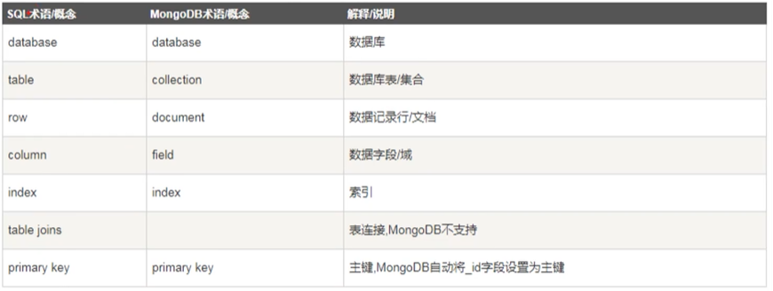

## 开始
MongoDB是一个基于文件存储的数据库，是NoSQL数据库，是一个介于关系型和非关系型数据库之间的产品。
他支持的数据结构非常松散，是类似json的bosn格式

特点：支持的的查询语言非常强大，其语法特点有点类似于面向对象查询语言，几乎可以实现类似关系数据库单表查询的绝大部分功能，
而且还支持对数据建立索引

```
安装 MongoDB 数据
https://www.mongodb.com/try/download/community
MongoDB 文档
https://www.mongodb.com/docs/manual/
教学视频
https://www.bilibili.com/video/BV1am4y1Q7rC?p=1

安装 Navicat Premium 15 图形化软件
安装node
npm install mongoose --save
```
术语概率


## 数据库相关命令
```
使用数据库，如果没有数据库自动创建一个数据库
数据库里面必须有集合，并且集合必须有数据才能看见
use 数据库名

查看数据库
show database
show dbs

删除数据库
db.dropDatabase()
```

## 集合操作
```
创建user集合，相当于MySql创建表
db.createCollection("user")
name:集合名，opions:可选参数，指定有关内存大小及索引的选项
db.createCollection(name,opions)
opions:{
    capped:布尔类型,可选,如果为true,则创建固定集合,集合大小固定,当达到最大值时,他会自动覆盖最早的文档;为true时必须指定size
    autoindexid:布尔类型,如果为true,自动在id字段上创建索引,默认false
    size:数值,可以指定集合最大值,以字节
    max:数值,固定集合中文档的最大数量(可以存多少条数据),使用时必须设置size和capped
}

删除集合
db.user.drop()

查看集合
show tables;
show collections;

插入文档，相当于MySql插入数据
db.user.insert({name:"小明",age:18})

//数据集合查询
db.user.find()
```

## 文档的操作
```
https://www.bilibili.com/video/BV1am4y1Q7rC?p=6&spm_id_from=pageDriver
6集
```
